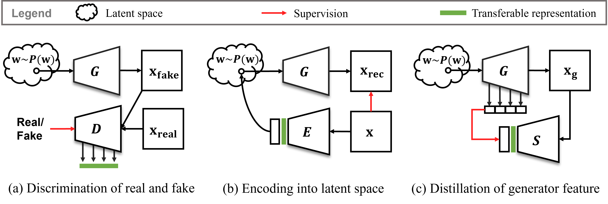
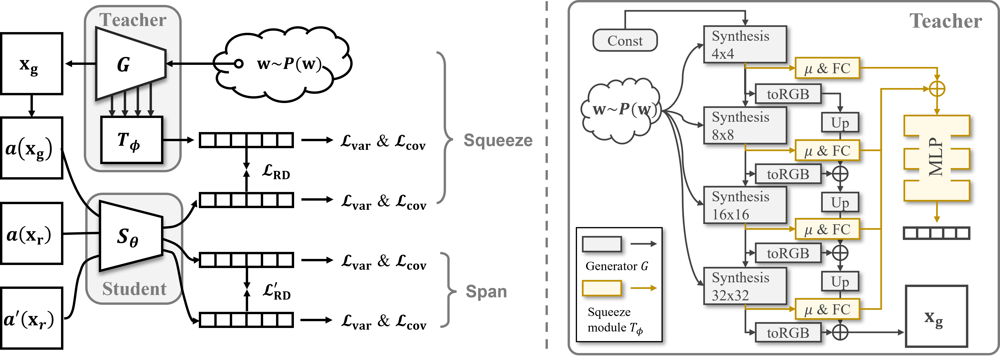

# DistillGAN
**Distilling Representations from GAN Generator via Squeeze and Span (NeurIPS'2022 anonymous submission)** 




## Dataset
Put data or create a soft link to the dataset root directory in `./data/`. For example, 
```
data/
├── CIFAR10
│   ├── cifar-10-batches-py
│   └── cifar-10-python.tar.gz
├── CIFAR100
│   ├── cifar-100-python
│   └── cifar-100-python.tar.gz
├── STL10
│   ├── stl10_binary
│   └── stl10_binary.tar.gz
```
Please download dataset from [CIFAR](https://www.cs.toronto.edu/~kriz/cifar.html), [STL10](https://cs.stanford.edu/~acoates/stl10/).

## Pre-trained GANs
Please download pre-trained GAN checkpoints from 

| File       | Url |
|:----       |:-----------|
| cifar10u-cifar-ada-best-fid.pkl  |  |
| cifar100u-cifar-best-fid4.13.pkl |  |
| stl10u-my128-best-fid20.86.pkl |  |

```
checkpoints/
├── cifar100u-cifar-best-fid4.13.pkl
├── cifar10u-cifar-ada-best-fid.pkl
└── stl10u-my128-best-fid20.86.pkl
```

## Experiment scripts

### Table 1: representation transfer from different teachers

| Knowledge Source | Transfer Method | Domain | CIFAR10 | CIFAR100 |
|:----       |:-----------| :-----| :---: | :---: |
| Discriminator | Direct use (single feature) | Syn. & Real | 63.81 \[[script](scripts/transfer_latent/eval_d_single_cifar10.sh)\]  | 30.11 \[[script](scripts/transfer_latent/eval_d_single_cifar100.sh)\] |
| Discriminator | Direct use (multi-feature) | Syn. & Real | 77.58 \[[script](scripts/transfer_latent/eval_d_multi_cifar10.sh)\]  | 51.63 \[[script](scripts/transfer_latent/eval_d_multi_cifar100.sh)\] |
| Latent variable | Encoding | Syn.  | 57.15 \[[script](scripts/transfer_latent/encode_w_syn_cifar10.sh)\]  | 32.19 \[[script](scripts/transfer_latent/encode_w_syn_cifar100.sh)\] |
| Latent variable | Encoding | Syn. & Real | 50.27 \[[script](scripts/transfer_latent/encode_w_syn_real_cifar10.sh)\]  | 28.43 \[[script](scripts/transfer_latent/encode_w_syn_real_cifar100.sh)\] |
| Latent variable | Vanilla distillation (w/ aug) | Syn. | 84.84 \[[script](scripts/transfer_latent/vanilla_distill_w_cifar10.sh)\]  | 53.26 \[[script](scripts/transfer_latent/vanilla_distill_w_cifar100.sh)\] |
| Latent variable | Squeeze | Syn. | 86.99 \[[script](scripts/transfer_latent/squeeze_w_cifar10.sh)\]  | 58.56 \[[script](scripts/transfer_latent/squeeze_w_cifar100.sh)\] |
| Generator feature | Vanilla distillation (w/ aug) | Syn. | 84.48 \[[script](scripts/transfer_latent/vanilla_distill_g_cifar10.sh)\]  | 52.77 [script](scripts/transfer_latent/vanilla_distill_g_cifar100.sh)\] |
| Generator feature | Squeeze | Syn. | 87.67 \[[script](scripts/squeeze_and_span/cifar10_squeeze.sh)\]  | 57.35 \[[script](scripts/squeeze_and_span/cifar100_squeeze.sh)\] |
| Generator feature | Squeeze and span | Syn. & Real | 92.54 \[[script](scripts/squeeze_and_span/cifar10_squ_spa.sh)\]  | 67.87 \[[script](scripts/squeeze_and_span/cifar100_squ_spa.sh)\] |


### Table 2: comparison to SSL

| Pretrain Data | Methods | CIFAR10 | CIFAR100 | STL10 |
|:----       |:-----------| :-----:| :---: | :---: |
| Real | SimSiam | 90.94 \[[script](scripts/compare_ssl/real_simsiam_cifar10.sh)\] | 62.44 \[[script](scripts/compare_ssl/real_simsiam_cifar100.sh)\]  | 58.52 \[[script](scripts/compare_ssl/real_simsiam_stl10.sh)\] |
| Real | VICReg | 89.20 \[[script](scripts/compare_ssl/real_vicreg_cifar10.sh)\] | 63.31 \[[script](scripts/compare_ssl/real_vicreg_cifar100.sh)\]  | 72.30 \[[script](scripts/compare_ssl/real_vicreg_stl10.sh)\] |
| Syn | SimSiam | 85.11 \[[script](scripts/compare_ssl/syn_simsiam_cifar10.sh)\] | 47.89 \[[script](scripts/compare_ssl/syn_simsiam_cifar100.sh)\]  | 59.85 \[[script](scripts/compare_ssl/syn_simsiam_stl10.sh)\] |
| Syn | VICReg | 84.68 \[[script](scripts/compare_ssl/syn_vicreg_cifar10.sh)\] | 52.84 \[[script](scripts/compare_ssl/syn_simsiam_cifar100.sh)\]  | 65.42 \[[script](scripts/compare_ssl/syn_vicreg_stl10.sh)\] |
| Syn | Squeeze (Ours) | 87.67 \[[script](scripts/squeeze_and_span/cifar10_squeeze.sh)\] | 57.35 \[[script](scripts/squeeze_and_span/cifa100_squeeze.sh)\]  | 65.73 \[[script](scripts/squeeze_and_span/stl10_squeeze.sh)\] |
| Real & Syn | SimSiam | 90.88 \[[script](scripts/compare_ssl/mix_simsiam_cifar10.sh)\] | 62.68 \[[script](scripts/compare_ssl/mix_simsiam_cifar100.sh)\]  | 55.87 \[[script](scripts/compare_ssl/mix_simsiam_stl10.sh)\] |
| Real & Syn | VICReg | 90.46 \[[script](scripts/compare_ssl/mix_vicreg_cifar10.sh)\] | 65.22 \[[script](scripts/compare_ssl/mix_vicreg_cifar100.sh)\]  | 69.32 \[[script](scripts/compare_ssl/mix_vicreg_stl10.sh)\] |
| Real & Syn | Squeeze & Span (Ours) | 92.54 \[[script](scripts/squeeze_and_span/cifar10_squ_spa.sh)\] | 67.87 \[[script](scripts/squeeze_and_span/cifar100_squ_spa.sh)\]  | 69.60 \[[script](scripts/squeeze_and_span/stl10_squ_spa.sh)\] |

### Table 3: ablation study

| | $\mathcal{L}_{\text{RD}}$ | $\mathcal{A}$ | $T_\phi$ | $\mathcal{L}_{\text{var}}$ | $\mathcal{L}_{\text{cov}}$ | Span | Top-1 Acc |
|:----|:----:| :----: | :---: | :---: | :---: | :---: | :---: |
a | $\checkmark$ |  |  |  |  |  | 74.20 \[[script](scripts/ablation/kd.sh)\] |
b | $\checkmark$ | $\checkmark$ |  |  |  | | 84.48 \[[script](scripts/transfer_latent/vanilla_distill_g_cifar10.sh)\] |
c | $\checkmark$ | $\checkmark$ | $\checkmark$ |  |   | | 10.00 \[[script](scripts/ablation/kd_squeeze_novar_nocov.sh)\] |
d | $\checkmark$ | $\checkmark$ | $\checkmark$ | $\checkmark$ |  | | 79.10 \[[script](scripts/ablation/kd_squeeze_nocov.sh)\] |
e | $\checkmark$ | $\checkmark$ | $\checkmark$ | $\checkmark$ | $\checkmark$  | | 87.67 \[[script](scripts/squeeze_and_span/cifar10_squeeze.sh)\] |
f | $\checkmark$ | $\checkmark$ | $\checkmark$ | $\checkmark$ | $\checkmark$  | $\checkmark$ | 92.54 \[[script](scripts/squeeze_and_span/cifar10_squ_spa.sh)\] |

### Visualization as in Fig 2

```bash
CUDA_VISIBLE_DEVICES=0 python plot_umap --output-dir=output/plot_umap --gpath=checkpoints/cifar10u-cifar-ada-best-fid.pkl --cpath=checkpoints/cifar10_wrn.pth
```

### Plot Fig 4

```bash
python paper_plots/acc_vs_fid.py
```

### Evaluatiion

| Dataset   | Script |
|:----      |:-------|
| CIFAR10   | scripts/cifar10_eval_linear.sh |
| CIFAR100  | scripts/cifar100_eval_linear.sh |
| STL10     | scripts/stl10_eval_linear.sh |


